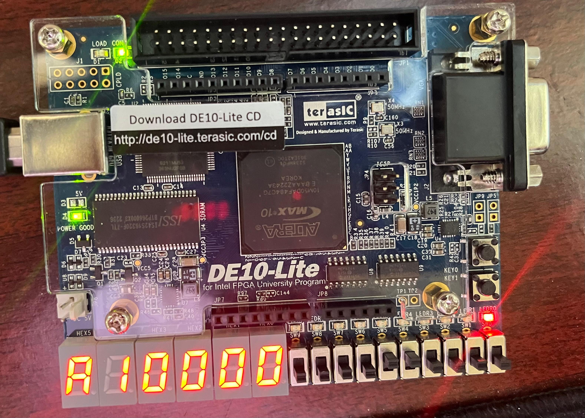
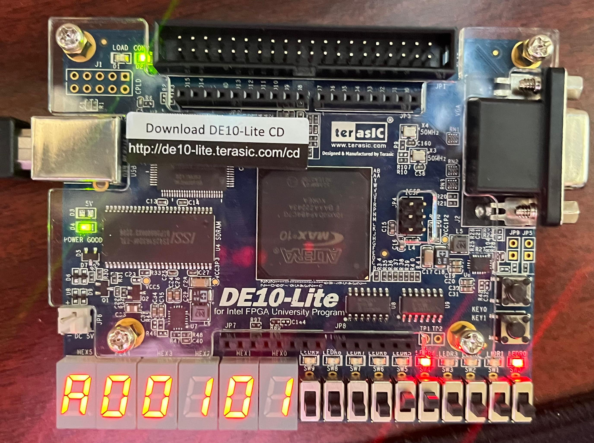
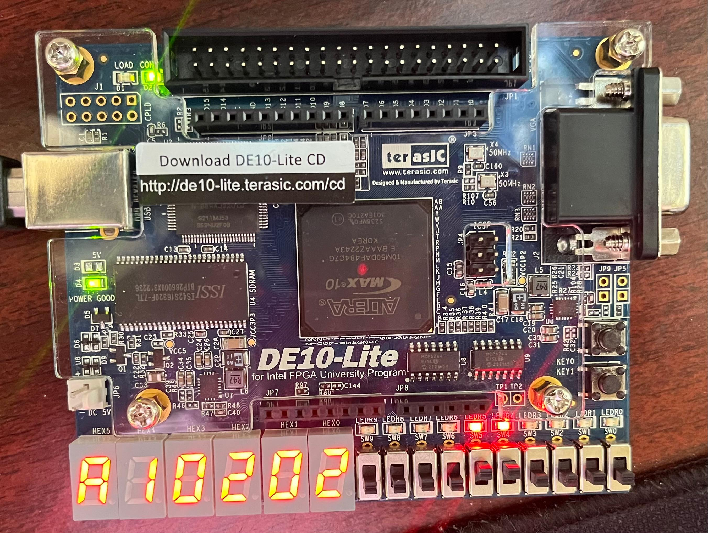
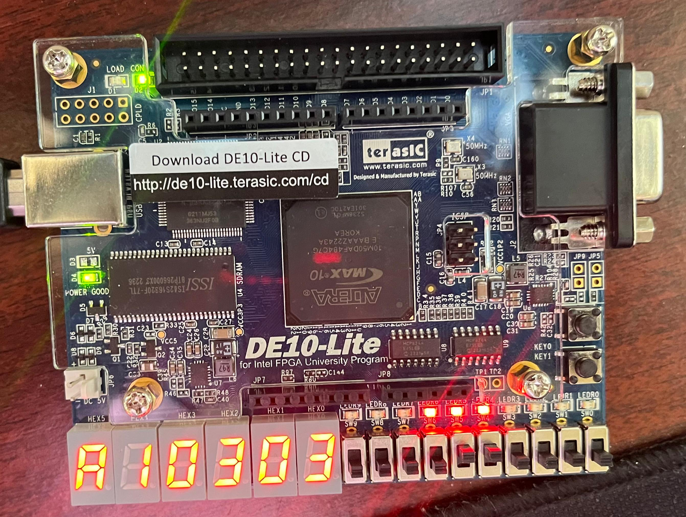
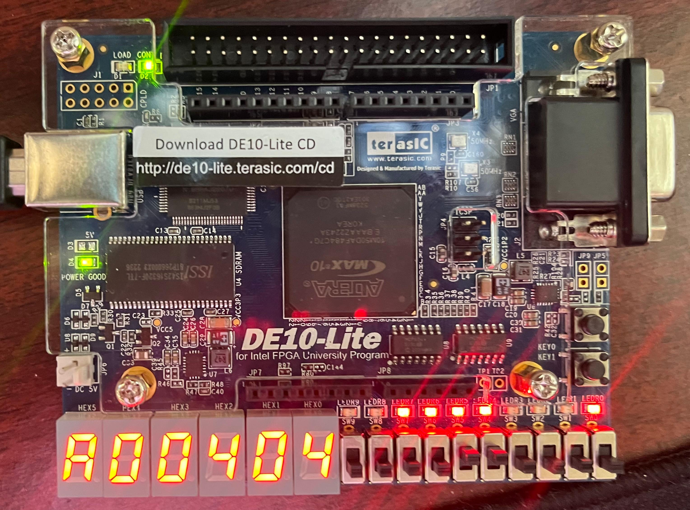
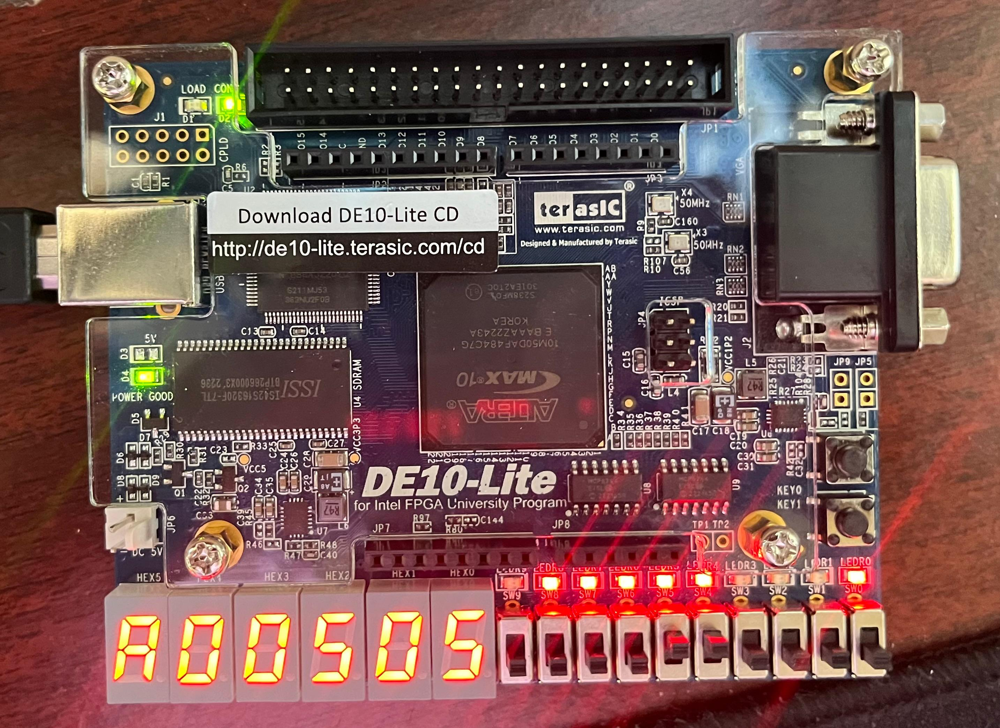
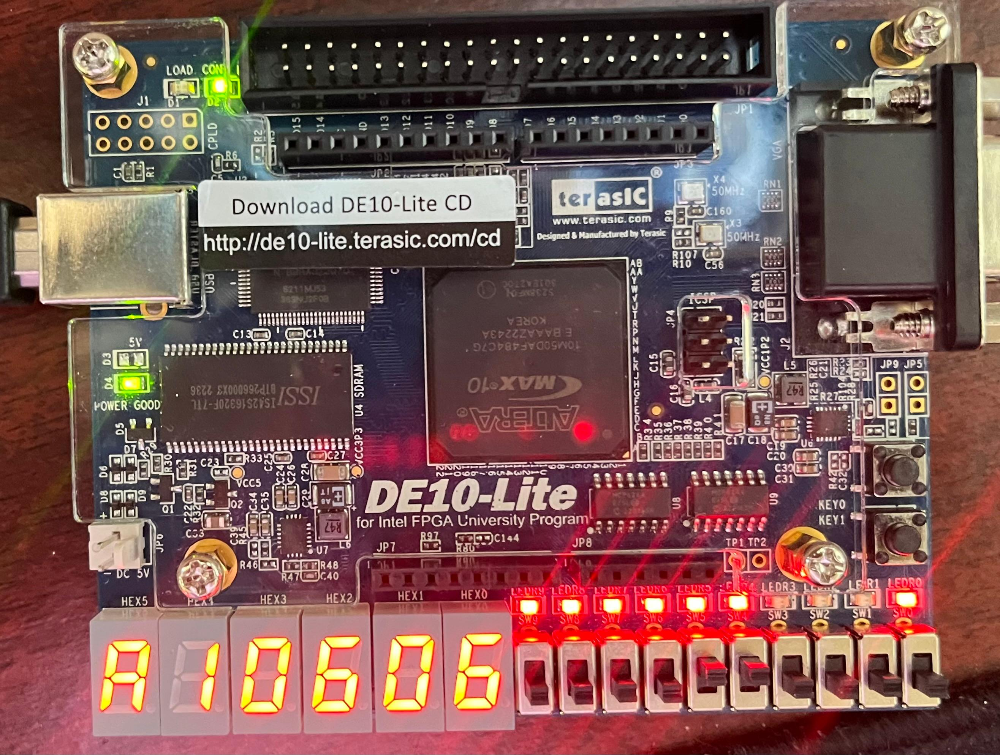
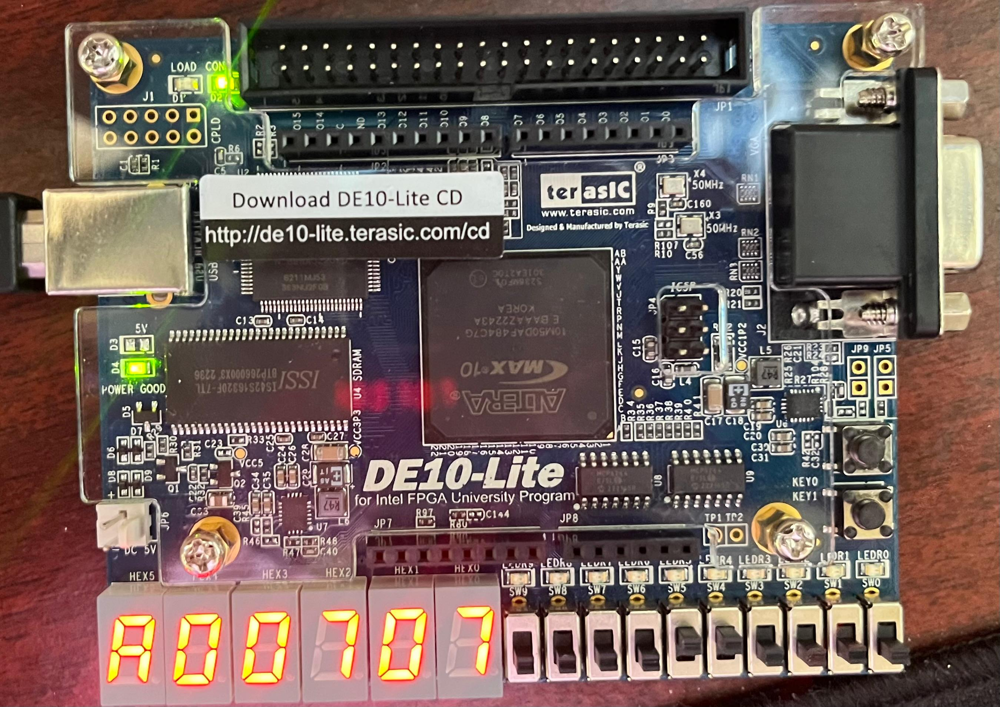

# GRU Neural Network Based Equalizer on FPGA

This project implements a **Gated Recurrent Unit (GRU)** based **neural network equalizer** for BPSK communication systems, deployed on an **Intel DE10-Lite FPGA**.  
The GRU model was trained using **PyTorch**, and the trained weights were quantized and integrated into FPGA logic for real-time signal equalization.

---

## 🚀 Project Overview

| Parameter | Description |
|------------|--------------|
| **Modulation** | BPSK |
| **Model Inputs** | 3 input features, sequence length 3 |
| **GRU Architecture** | 3 neurons, single layer |
| **Hardware Platform** | Intel DE10-Lite FPGA |
| **Logic Utilization** | 24,670 Logic Blocks |
| **Inference Latency** | 86 µs per sequence |
| **Test Accuracy** | < 1% error across 8 test cases |

---

## ⚙️ Implementation Workflow

1. **Model Training (Python + PyTorch)**
   - Designed a lightweight GRU model for channel equalization.
   - Trained on noisy BPSK sequences generated in Python.
   - Exported trained weights for fixed-point FPGA implementation.

2. **Hardware Deployment**
   - Weights converted and integrated into HDL.
   - Implemented custom GRU cell using Verilog.
   - Deployed on **Intel DE10-Lite FPGA** using **Intel Quartus Prime**.
   - Measured real-time inference using onboard testbench.

3. **Testing**
   - Evaluated on 8 channel scenarios (AWGN + mild multipath).
   - Achieved <1% symbol error rate on all test cases.

---

## ✅ Simulation & Hardware Validation Results

The FPGA implementation of the GRU-based equalizer was verified using a **gate-level Verilog testbench**.  
All 8 test cases passed successfully with less than **0.6% prediction error**, validating the correctness of weight mapping, arithmetic, and control FSM timing.

### 🔬 Testbench Log Summary

| Test Case | Predicted | Expected | Abs. Error | Result |
|------------|------------|-----------|-------------|----------|
| 0 | 0.998079 | 1.000071 | 0.001992 | ✅ PASS |
| 1 | 0.998477 | 0.999508 | 0.001031 | ✅ PASS |
| 2 | 0.998028 | 1.000284 | 0.002256 | ✅ PASS |
| 3 | -1.004128 | -0.998272 | 0.005856 | ✅ PASS |
| 4 | 1.002403 | 1.000745 | 0.001659 | ✅ PASS |
| 5 | 0.998400 | 0.999283 | 0.000883 | ✅ PASS |
| 6 | -1.004687 | -0.998748 | 0.005939 | ✅ PASS |
| 7 | 1.002257 | 1.000832 | 0.001425 | ✅ PASS |

**Simulation Summary:**  
✅ **Passed 8/8 test cases**  
⚡ **Average absolute error:** 0.0029 (~0.29%)  
🧮 **Maximum deviation:** 0.0059 (~0.6%)  
🕒 **Total simulation time:** ~995 µs equivalent (gate-level)

---

## 🧩 Tools and Technologies

- **PyTorch** – GRU model design and training  
- **NumPy, Matplotlib** – Data generation and visualization  
- **Intel Quartus Prime** – FPGA synthesis and deployment  
- **Verilog** – Custom GRU cell and equalizer logic implementation  
- **Python → HDL workflow** – Quantized weight integration

---

## 🧠 Key Highlights

- Designed a compact GRU NN optimized for FPGA logic constraints.  
- Achieved real-time equalization at microsecond-scale latency.  
- Demonstrated generalization across multiple BPSK test scenarios.  
- Balanced accuracy and resource utilization effectively.

---

## 📷 FPGA Output Gallery

Below are hardware results for all **9 test cases (0–8)**:

| Test Case | FPGA Output | Status | Error Tier |
|------------|-------------|---------|-------------|
| **0** |  | ✅ PASS | <1% |
| **1** |  | ✅ PASS | <0.3% |
| **2** |  | ✅ PASS | <1% |
| **3** |  | ✅ PASS | <0.3% |
| **4** |  | ✅ PASS | <1% |
| **5** |  | ✅ PASS | <0.3% |
| **6** |  | ✅ PASS | <1% |
| **7** |  | ✅ PASS | <0.3% |
| **8** |  | ✅ PASS | <1% |

*(All test cases passed successfully with ≤0.6% absolute prediction error.)*

---

### ⚙️ Hardware Summary

| Metric | Value |
|--------|--------|
| FPGA Board | Intel DE10-Lite |
| Logic Utilization | 24,670 Logic Blocks |
| Inference Time | 86 µs |
| Model | GRU (3 neurons, 3 inputs, 3 sequence length) |
| Frameworks | PyTorch (training) → Verilog (deployment) |
| Verification | 9 hardware test cases (0–8) passed with <1% error |

---

### 🧩 Directory Layout for FPGA Results
