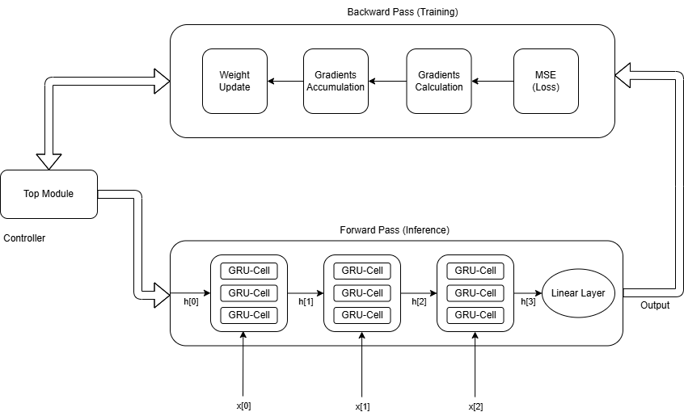
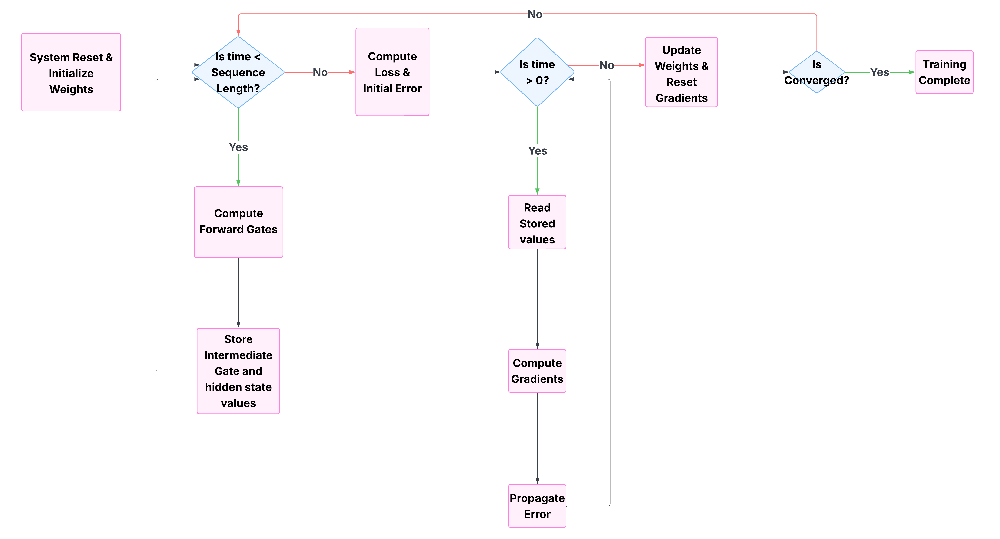
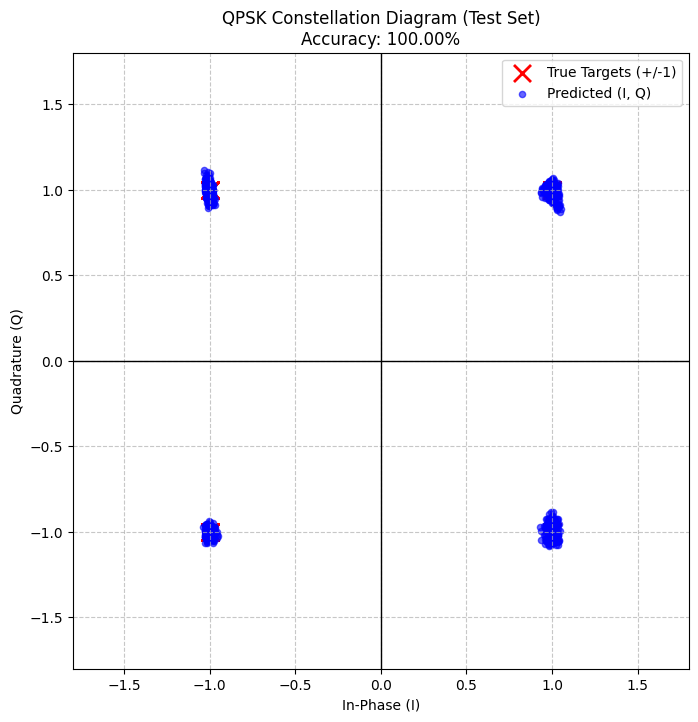
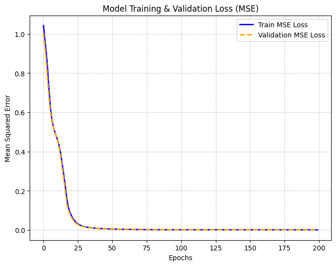
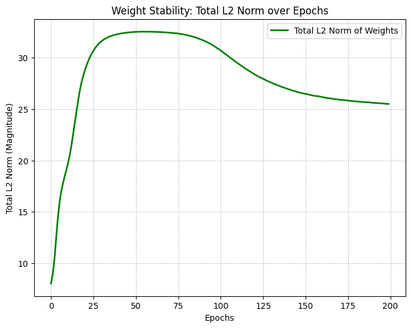
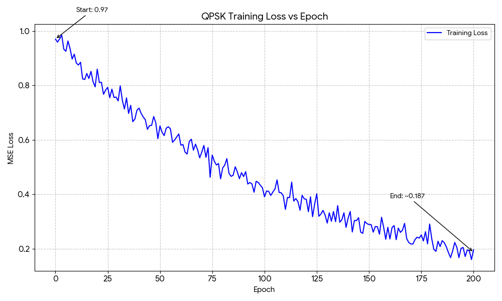

# GRU(RNN)-Based Neural Network Optical Channel Equaliser on FPGA

> Note:
> This repository includes the project architecture, verification flow, FPGA deployment results, and supporting implementation files. Some internal RTL modules related to ongoing development and research work are intentionally omitted from the current public release.

Implementation of a GRU (Gated Recurrent Unit) based neural network equalizer in Verilog for digital communication systems, including both inference and on-chip training using Backpropagation Through Time (BPTT).

This project explores how recurrent neural networks can be implemented directly in hardware for adaptive channel equalization, where the communication channel characteristics vary over time and traditional DSP equalizers become less effective.

The work includes:

* Python/PyTorch model development
* Verilog RTL implementation
* FPGA deployment on Intel DE10-Lite
* On-chip GRU training using BPTT
* Gradient descent based weight updates
* RTL and FPGA verification

---

# Project Motivation

Communication channels introduce:

* noise,
* distortion,
* and inter-symbol interference (ISI).

Traditional equalizers work well for linear systems, but their complexity increases significantly for non-linear and time-varying channels.

Recurrent Neural Networks (RNNs), especially GRUs, are better suited for this problem because they maintain a hidden state that acts as memory across time steps. This allows the network to learn temporal dependencies caused by ISI.

The objective of this project was to design a trainable GRU architecture completely in Verilog that could:

* perform sequence-based equalization,
* execute inference directly on FPGA,
* and update weights on-chip using BPTT and SGD.

---

# Why GRU Instead of Standard RNN?

Standard RNNs suffer from:

* vanishing gradients,
* exploding gradients,
* unstable long-sequence training.

GRUs solve this using gating mechanisms:

* Reset Gate
* Update Gate

These gates regulate:

* how much past information should be forgotten,
* and how much should be retained.

This improves training stability and allows the model to learn temporal channel behavior more effectively.

---

# Project Evolution

The project evolved through two major stages.

---

# Phase 1 — BPSK GRU Equalizer

The first version focused on:

* understanding GRU inference in hardware,
* FPGA deployment,
* and validating basic equalization capability.

## Features

* BPSK modulation support
* GRU inference engine in Verilog
* Fixed-point arithmetic
* FPGA deployment on Intel DE10-Lite
* Python-trained weights exported into hardware

## Results

* Successfully deployed on FPGA
* Less than 1% prediction error
* Correct symbol prediction across all test cases

---

# Phase 2 — QPSK + On-Chip Training

The second version significantly expanded the architecture.

Major improvements included:

* QPSK support
* IEEE-754 floating-point arithmetic
* Serialized hardware architecture
* Backpropagation Through Time (BPTT)
* On-chip gradient calculation
* On-chip SGD weight updates
* Gradient clipping
* Hardware training controller
* Gate-state caching for temporal backpropagation

This stage focused on implementing a fully trainable recurrent neural network directly in Verilog.

---

# GRU Architecture Overview

The complete hardware architecture consists of:

```text
Input Sequence
      ↓
GRU Layer
      ↓
Linear Output Layer
      ↓
Prediction
      ↓
Loss Calculation
      ↓
BPTT Gradient Engine
      ↓
Weight Update (SGD)
      ↓
Updated Parameters
```

---

# Block Diagram

The following diagram shows the overall hardware architecture used for inference and on-chip training.

The design contains:

* GRU inference modules,
* BPTT training modules,
* gradient accumulation,
* and SGD-based weight update engines.



**Figure:** *Top-level architecture of the GRU-based equalizer and training pipeline.*

---

# Training Flowchart

The flowchart below summarizes the complete hardware training process.

The controller:

1. initializes weights,
2. performs forward inference,
3. stores intermediate gate states,
4. computes gradients using BPTT,
5. updates weights using SGD,
6. repeats until convergence.



**Figure:** *Flowchart of the complete hardware training algorithm.*

---

# GRU Equations Implemented in Hardware

The following GRU equations were implemented directly in Verilog.

---

## Reset Gate

```text
rt = σ(Wrxt + Urht−1 + br)
```

Controls how much previous memory should be discarded.

---

## Update Gate

```text
zt = σ(Wzxt + Uzht−1 + bz)
```

Controls how much past information should be retained.

---

## Candidate State

```text
nt = tanh(Whxt + rt(Uhht−1) + bh)
```

Computes the new candidate memory.

---

## Final Hidden State

```text
ht = (1 − zt)nt + ztht−1
```

Combines previous memory with newly computed information.

---

# Hardware Design Philosophy

One of the main engineering challenges was FPGA resource limitation.

A fully parallel floating-point GRU implementation would consume large amounts of:

* DSP blocks,
* logic elements,
* and memory resources.

To solve this, the design uses a serialized architecture.

Instead of instantiating many FPUs in parallel:

* arithmetic units are reused sequentially,
* FSMs schedule operations,
* and intermediate gate states are cached for BPTT.

This significantly reduced hardware usage while still supporting complete training functionality.

---

# Major Verilog Modules

---

# Arithmetic Units

## Floating Point Multiplier / Adder / Subtractor

IEEE-754 single precision arithmetic modules used throughout the design.

Used for:

* matrix multiplication,
* gate computation,
* loss calculation,
* gradient computation,
* and SGD updates.

---

# Dot Product Unit (`dot_product`)

Computes vector dot products using a serialized multiply-accumulate architecture.

Instead of parallel MAC units:

* one multiplier and one adder are reused iteratively,
* controlled using FSM scheduling.

This reduced FPGA resource utilization significantly.

---

# Activation Function Modules

## `SigMoid`

Implements sigmoid activation using LUT approximation.

## `tanh`

Implements tanh activation using LUT approximation.

Instead of directly calculating exponentials in hardware:

* precomputed activation values are stored in ROM,
* floating-point inputs are mapped to LUT addresses.

This greatly reduces hardware complexity.

---

# Gradient Clipper

Implements gradient clipping to prevent exploding gradients during training.

The module:

* limits gradient magnitude,
* stabilizes training,
* and prevents numerical overflow.

---

# GRU Inference Modules

---

# Gate Calculation Unit (`gate_cal`)

Computes:

* reset gate,
* update gate,
* candidate hidden state.

Uses:

* dot product engines,
* activation modules,
* and floating-point arithmetic units.

---

# GRU Cell (`GRU_Cell_BPTT`)

Implements one GRU timestep.

The FSM sequence:

1. Reset gate computation
2. Update gate computation
3. Candidate state computation
4. Final hidden state update

Internal gate outputs are also stored for later use during BPTT.

---

# GRU Layer (`GRU_Layer_BPTT`)

Processes the complete sequence.

Responsibilities include:

* iterating through timesteps,
* maintaining hidden states,
* caching intermediate values,
* and coordinating serialized GRU-cell execution.

---

# Linear Layer (`linear_layer`)

Maps the final hidden state to:

* predicted I component,
* predicted Q component.

Used as the final output stage for QPSK prediction.

---

# Training Architecture

A major contribution of this project was implementing on-chip training directly in hardware.

Unlike inference-only accelerators, this design computes gradients and updates weights internally.

---

# BPTT Controller (`Training_Controller`)

Controls the complete training process.

## Forward Pass

* processes input sequences,
* stores intermediate states,
* computes prediction outputs.

## Backward Pass

* traverses timesteps in reverse order,
* computes gradients,
* accumulates updates,
* triggers SGD weight updates.

---

# GRU Backward Engine (`GRU_Backward`)

Implements:

* chain rule calculations,
* temporal gradient propagation,
* weight gradient calculation.

Uses stored:

* hidden states,
* reset gates,
* update gates,
* candidate states.

---

# Weight Update Engine

Implements SGD updates using:

```text
Wnew = Wold − η∇W
```

where:

* η = learning rate
* ∇W = computed gradient

---

# FPGA Platform

## Hardware

* Intel DE10-Lite FPGA

## Tools Used

* Verilog HDL
* Intel Quartus Prime
* ModelSim
* Vivado
* Python
* PyTorch
* NumPy
* Matplotlib

---

# Network Configuration

| Parameter       | Value              |
| --------------- | ------------------ |
| Modulation      | QPSK               |
| Input Features  | 2 (I/Q)            |
| Hidden Units    | 3                  |
| Output Features | 2                  |
| Sequence Length | 3                  |
| Precision       | IEEE-754 Float32   |
| Loss Function   | Mean Squared Error |

---

# Python Golden Model

Before hardware implementation, the GRU architecture was first developed and validated in Python using PyTorch.

The Python model was used to:

* verify GRU convergence behavior,
* validate BPTT equations,
* export trained weights,
* and compare RTL outputs against software references.

---

# Python Training Results

---

## QPSK Constellation Diagram

The trained Python model correctly learned the QPSK constellation mapping and accurately predicted transmitted symbols.

The clustering of predicted points around the ideal constellation locations confirms successful equalization and low prediction error.



**Figure:** *QPSK constellation diagram generated from the trained Python model.*

---

## MSE vs Epoch

The Mean Squared Error converged rapidly during training.

Most convergence occurred within the first 25 epochs, indicating that the GRU architecture successfully learned the channel characteristics.



**Figure:** *Training and validation MSE convergence of the Python GRU model.*

---

## Weight Stability Analysis

The L2 norm of the weights was monitored during training to observe convergence behavior.

The curve stabilizes after training progresses, indicating stable parameter convergence.



**Figure:** *L2 norm of GRU weights across training epochs.*

---

# RTL Simulation Results

After validating the architecture in Python, the complete GRU inference and training pipeline was implemented in Verilog and tested using RTL simulation.

The RTL implementation reproduced the expected convergence behavior observed in software.

---

## RTL Training Convergence

The RTL simulation demonstrated successful convergence of the hardware training loop.

The Mean Squared Error reduced from:

* 0.8931
  to
* 0.0089

over 50 training epochs.

This verified:

* correctness of the BPTT equations,
* gradient propagation logic,
* and hardware SGD updates.


**Figure:** *Training loss convergence during RTL simulation.*

---

# FPGA Hardware Validation

The design was tested on Intel DE10-Lite FPGA hardware.

Both inference and training behavior were validated using:

* Python-exported weights,
* on-chip training logic,
* and hardware-generated outputs.

---

## FPGA Constellation Output

The FPGA implementation correctly reproduced the QPSK constellation points with high accuracy.

Measured performance:

* MSE ≈ 0.001373
* Accuracy ≈ 99.86%


**Figure:** *Constellation diagram generated from FPGA inference outputs using Python-exported weights.*

---

## FPGA On-Chip Training Results

The FPGA implementation successfully demonstrated on-chip learning using SGD-based weight updates.

The hardware training loop reduced the loss from:

* 0.96
  to
* 0.0187

over 200 epochs.

Although oscillations are present, the overall trend confirms successful convergence of the hardware training architecture.



**Figure:** *Hardware training loss convergence on Intel DE10-Lite FPGA.*

---

# Verification Methodology

The project was verified at multiple stages.

## Python Validation

* Verified GRU convergence behavior
* Verified constellation prediction accuracy
* Verified exported weight correctness

## RTL Simulation

* Compared RTL outputs against software references
* Verified gradient convergence during training
* Verified BPTT arithmetic correctness

## FPGA Validation

* Verified inference outputs on FPGA
* Verified training convergence on hardware
* Verified QPSK constellation reconstruction

---

# Exported Weights

Weights trained in Python were exported and loaded into the Verilog architecture for inference validation.

The exported parameters included:

* Reset gate weights
* Update gate weights
* Candidate state weights
* Hidden-state matrices
* Output layer weights
* Bias vectors

This enabled direct comparison between:

* Python outputs,
* RTL simulation outputs,
* and FPGA outputs.

---

# Future Improvements

Possible future improvements include:

* Adam/RMSProp optimizer implementation
* BF16 or mixed-precision arithmetic
* Larger hidden-state architectures
* Multi-layer GRUs
* LSTM implementation
* AXI-stream interfaces
* Longer sequence support
* Improved activation approximations
* Better memory optimization

---

# References

[1] A. Bhawsar and A. Srivastava, “Multilayer perceptron equalizer using neural network accelerators,” IIT Goa, Goa, India, B.Tech. Project Report, 2025.

[2] P. J. Freire et al., “Implementing neural network-based equalizers in coherent optical transmission systems using field-programmable gate arrays,” *Journal of Lightwave Technology*, vol. 41, no. 12, pp. 3797–3812, Jun. 2023. doi:10.1109/JLT.2023.3272011

[3] F. Ortega-Zamorano, J. M. Jerez, D. U. Muñoz, R. M. Luque-Baena, and L. Franco, “Efficient implementation of the backpropagation algorithm in FPGAs and microcontrollers,” *IEEE Transactions on Neural Networks and Learning Systems*, vol. 27, no. 9, pp. 1840–1853, Sep. 2016. doi:10.1109/TNNLS.2015.2460991

[4] Y. Umuroglu et al., “FINN: A framework for fast and flexible quantized neural network inference,” *IEEE Transactions on Computers*, vol. 70, no. 4, pp. 631–644, Apr. 2021.

[5] K. Cho et al., “Learning Phrase Representations using RNN Encoder–Decoder for Statistical Machine Translation,” in *Proceedings of the Conference on Empirical Methods in Natural Language Processing (EMNLP)*, Doha, Qatar, Oct. 2014, pp. 1724–1734. doi:10.3115/v1/D14-1179

[6] S. Mandal et al., “FPGA-based online learning using approximate hardware accelerators,” in *Proceedings of the International Conference on Field-Programmable Logic and Applications (FPL)*, 2021.

---

# Author

Roshan Sharma
B.Tech, Electrical Engineering
IIT Goa
