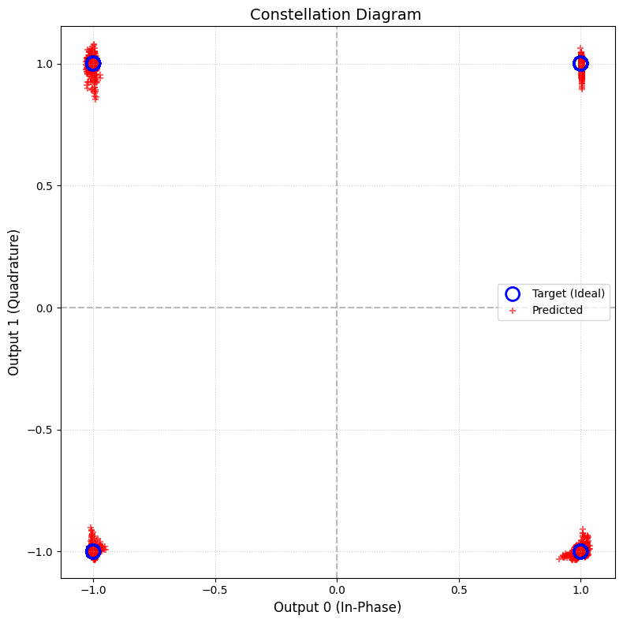
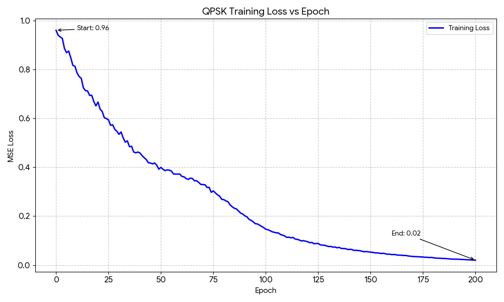
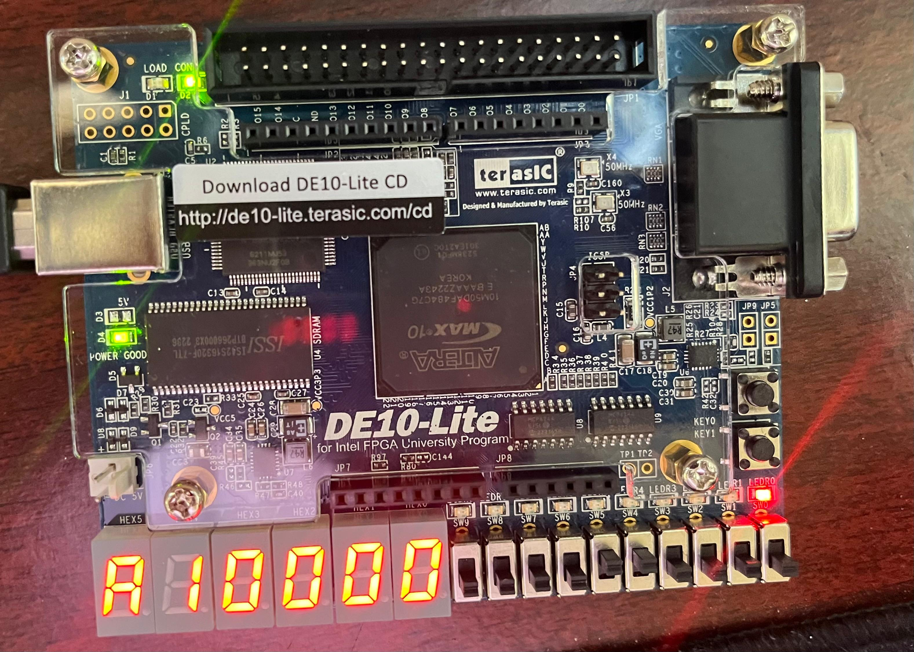
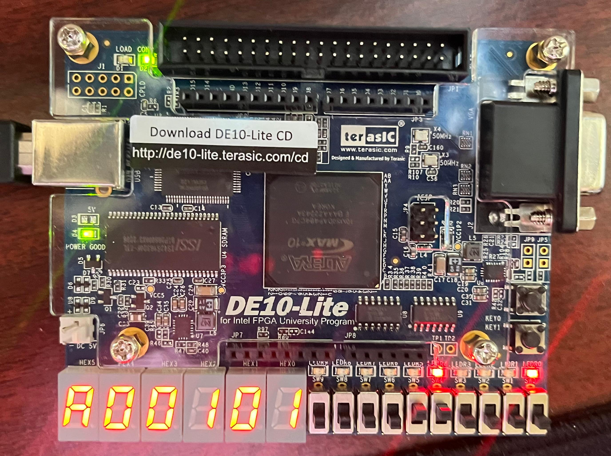
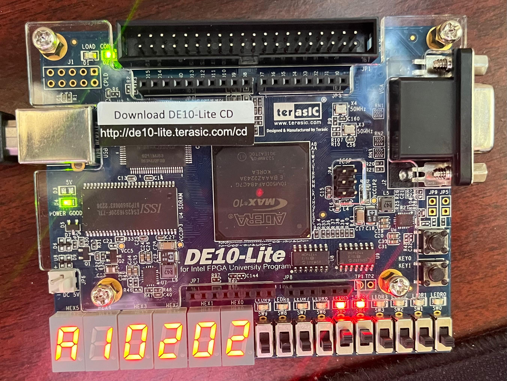
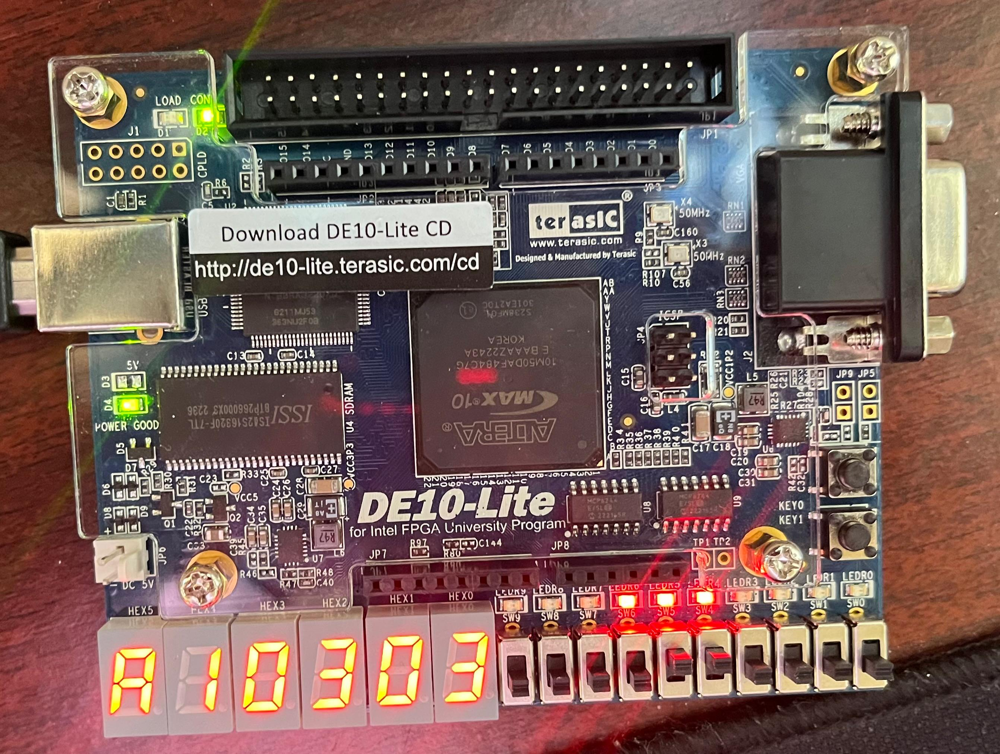
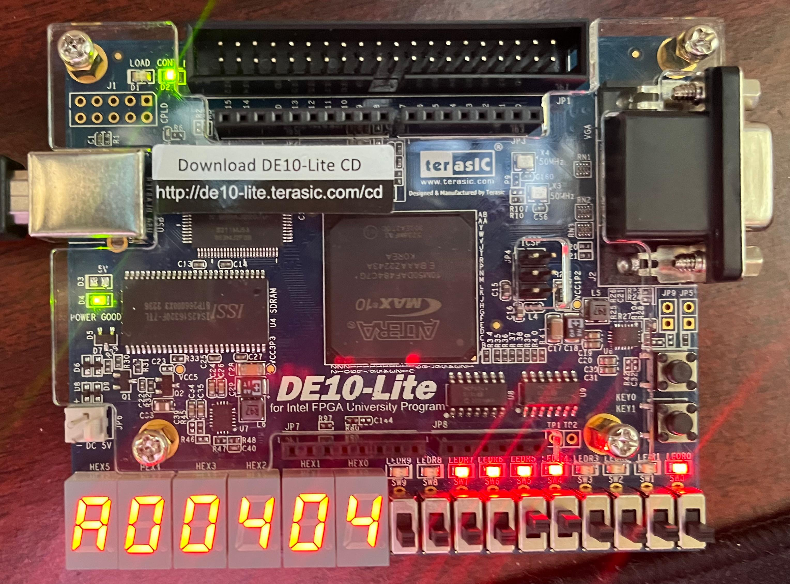
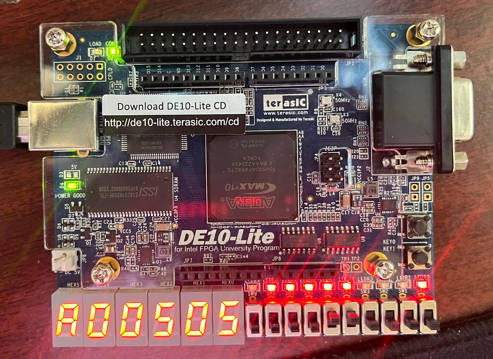
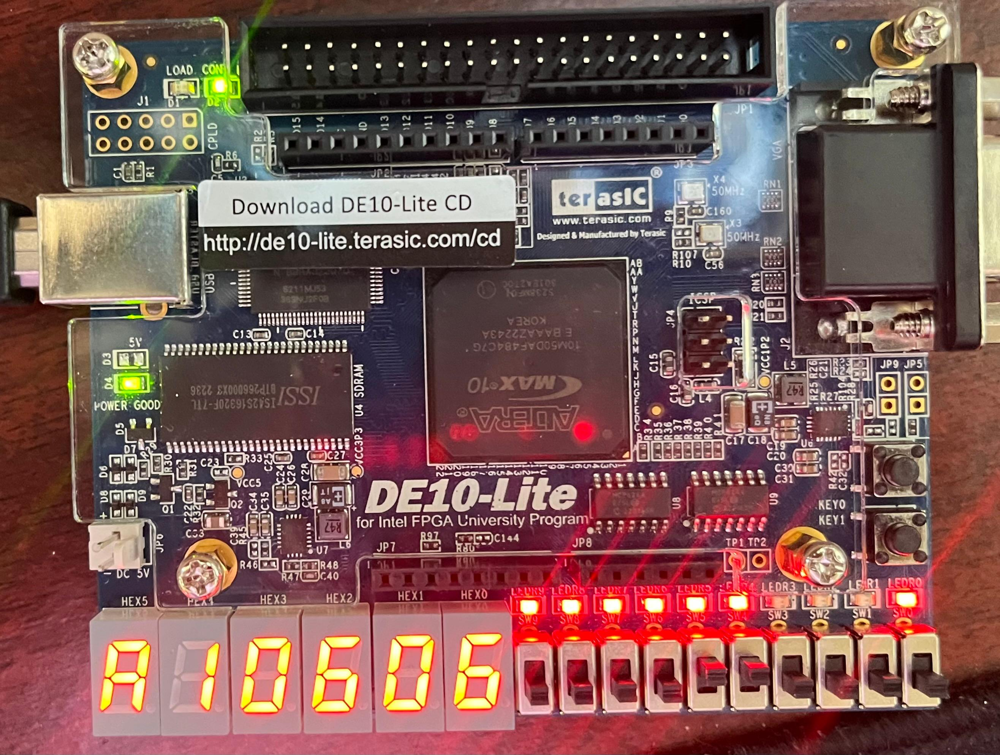
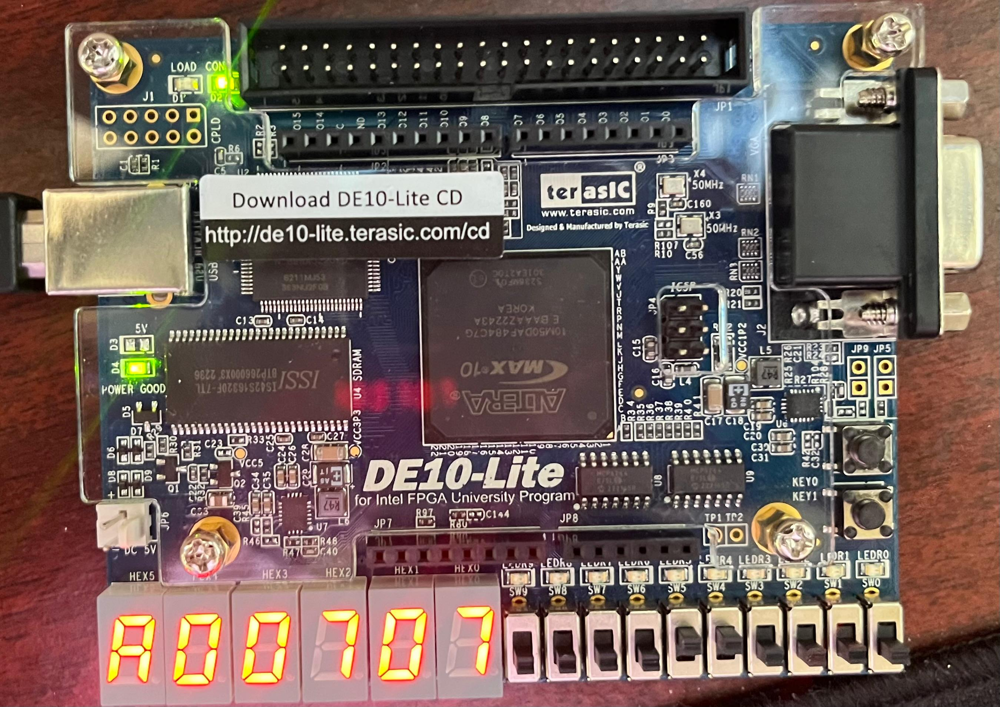

# GRU Neural Network Based Equalizer on FPGA

> **⚠️ Project Status: Research Embargo**
>
> This repository currently contains the **Phase 1 (BPSK Inference)** implementation of the GRU Equalizer.
>
> The **Phase 2 (QPSK + On-Chip SGD Training)** implementation, as described in my resume/portfolio, is currently **private** pending the publication of a research paper.
> * **Current Public Code:** BPSK Inference-only Model (Fixed Point).
> * **Private Code:** Serialized IEEE-754 Floating Point Architecture, QPSK Support, and On-Chip BPTT Training Module.
>
> *Full RTL and architecture details for Phase 2 can be shared upon request.*

---

## 🚀 Project Evolution

This project was developed in two distinct phases to explore hardware-accelerated neural networks for optical communication.

### **Phase 1: BPSK Inference (Open Source)**
* **Goal:** Proof-of-concept for running RNNs on FPGA.
* **Architecture:** Parallelized Fixed-Point Arithmetic.
* **Status:** ✅ **Code available in this repo.**

### **Phase 2: QPSK & On-Chip Training (Research Version)**
* **Goal:** Adaptive channel equalization with real-time learning.
* **Architecture:** Serialized **IEEE-754 Single Precision (Float32)**.
* **Key Feature:** Implements **Backpropagation Through Time (BPTT)** entirely in hardware using Stochastic Gradient Descent (SGD).
* **Status:** 🔒 **Code Private (See Results Below).**

---

## 📊 Phase 2: QPSK Results (Research Preview)

Although the source code for Phase 2 is private, the hardware validation results on the **Intel DE10-Lite** are presented below.

### 1. QPSK Constellation & Accuracy
The system achieved **99.86% accuracy (MSE ~0.001)** on QPSK symbol detection after on-chip training.

*(Fig 10 from Project Report: QPSK Constellation Diagram for Python Exported weights on DE10-Lite)*

### 2. On-Chip Training Convergence
The hardware-based SGD algorithm successfully minimized the Mean Squared Error (MSE) from **0.96 to 0.0187** over 200 epochs.

*(Fig 11 from Project Report: MSE vs Epoch plot for 10 samples on DE-10 Lite)*

---

## 🛠️ Phase 1: BPSK Implementation Details (Current Code)

The code currently available in this repository implements the **Phase 1 BPSK Model**.

| Parameter | Description |
|------------|--------------|
| **Modulation** | BPSK |
| **Model Inputs** | 3 input features, sequence length 3 |
| **GRU Architecture** | 3 neurons, single layer |
| **Hardware Platform** | Intel DE10-Lite FPGA |
| **Logic Utilization** | 24,670 Logic Blocks |
| **Inference Latency** | 86 µs per sequence |
| **Test Accuracy** | < 1% error across 8 test cases |

### Implementation Workflow

1. **Model Training (Python + PyTorch)**
   - Designed a lightweight GRU model for channel equalization.
   - Trained on noisy BPSK sequences generated in Python.
   - Exported trained weights for fixed-point FPGA implementation.

2. **Hardware Deployment**
   - Weights converted and integrated into HDL.
   - Implemented custom GRU cell using Verilog.
   - Deployed on **Intel DE10-Lite FPGA** using **Intel Quartus Prime**.
   - Measured real-time inference using onboard testbench.

---

## ✅ Phase 1: Simulation & Hardware Validation

The FPGA implementation of the BPSK equalizer was verified using a **gate-level Verilog testbench**. All 8 test cases passed successfully with less than **0.6% prediction error**.

### 🔬 Testbench Log Summary

| Test Case | Predicted | Expected | Abs. Error | Result |
|------------|------------|-----------|-------------|----------|
| 0 | 0.998079 | 1.000071 | 0.001992 | ✅ PASS |
| 1 | 0.998477 | 0.999508 | 0.001031 | ✅ PASS |
| 2 | 0.998028 | 1.000284 | 0.002256 | ✅ PASS |
| 3 | -1.004128 | -0.998272 | 0.005856 | ✅ PASS |
| 4 | 1.002403 | 1.000745 | 0.001659 | ✅ PASS |
| 5 | 0.998400 | 0.999283 | 0.000883 | ✅ PASS |
| 6 | -1.004687 | -0.998748 | 0.005939 | ✅ PASS |
| 7 | 1.002257 | 1.000832 | 0.001425 | ✅ PASS |

**Simulation Summary:** ✅ **Passed 8/8 test cases** ⚡ **Average absolute error:** 0.0029 (~0.29%)  
🧮 **Maximum deviation:** 0.0059 (~0.6%)  
🕒 **Total simulation time:** ~995 µs equivalent (gate-level)

---

## 📷 Phase 1: FPGA Output Gallery

Below are hardware results for all **9 test cases (0–8)** from the BPSK implementation:

| Test Case | FPGA Output | Status | Error Tier |
|------------|-------------|---------|-------------|
| **0** |  | ✅ PASS | <1% |
| **1** |  | ✅ PASS | <0.3% |
| **2** |  | ✅ PASS | <1% |
| **3** |  | ✅ PASS | <1% |
| **4** |  | ✅ PASS | <0.3% |
| **5** |  | ✅ PASS | <0.3% |
| **6** |  | ✅ PASS | <1% |
| **7** |  | ✅ PASS | <0.3% |

---

## 🧩 Tools and Technologies

- **PyTorch** – GRU model design and training  
- **NumPy, Matplotlib** – Data generation and visualization  
- **Intel Quartus Prime** – FPGA synthesis and deployment  
- **Verilog** – Custom GRU cell and equalizer logic implementation  
- **Python → HDL workflow** – Quantized weight integration

---

### 📬 Contact & Access

For inquiries regarding the **Phase 2 (Research Version)** code or architecture details, please contact:
**Roshan Sharma** - [roshan.sharma.22042@iitgoa.ac.in](mailto:roshan.sharma.22042@iitgoa.ac.in)
